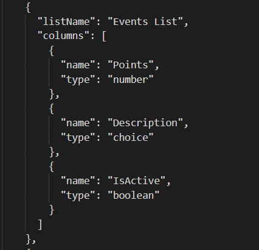

# Champion Management Platform 

## Introduction:
The Champion Management Platform is a custom Teams app that enables organizations to onboard and maintain champions/ SME in their organization in Teams, allowing everyone discover Champions right where they collaborate. Utilize this template for multiple scenarios, such as new initiative adoption, champion onboarding, or to maintain organization-wide Subject Matter Experts.

The app provides an easy interface for designated users to add members to the champion program, preview, collaborate and communicate and build a community of power users and coaches.  <br/>

                    

## How it works:

1.	The current version of the Champion Management Platform operates as an app in Microsoft Teams that is installed locally in your tenant by your tenant administrator or any user who has the capability to side load the application.
2.  Once installed, it can be accessed via “+Add a tab”  option at the top of the channel within a team. ***Channel > Add a tab > Champion Management Platform***
3.	The app installation process will create a SharePoint list (***Members List*** )to store all users who are nominated to be a champion. A local administrator is responsible for maintaining this SharePoint list. This person can be the individual who manages the Champion program for the organization or his/her delegate.
4.	The app provides an easy interface for approved employees (Champions) to showcase their Focus area, preview, collaborate and even add their colleagues as new champions.
5.	There are 3 major components in Champion Management Platform. 
..a.	Champion management
..b.	Leaderboard 
..c.	Digital badging
6.	The Champions will be earning points for hosting events, writing Blogs, moderating Office hours etc., Leaderboard ranks all the champions based on their points globally, regionally, and even by focus area.
7.	Point accumulation , ranking logic, Event details are configurable by the Admin based on the organization  needs. <br/>

 

### Champion Leaderboard:

Leaderboard solution is intended to add a gaming aspect to the Teams Champions program by allowing champions to earn points for the various ways they are promoting and supporting the internal adoption of their areas of interest. This also gives an opportunity to reflect their activity in comparison to other champs. Leaderboard has mainly 2 different views based on the role of that employee.
Roles can be categorized as: 
* i.	Admin/Moderator OR Champion
* ii.	Employee 


### Admin/Moderator OR Champion view
In our Champions program, Admin is a Champion by default.  The Champion view is to enable Administrator or Champions to identify all the members of the Champions program. 
<br/>

          


#### An Admin / Champion can do the following: 

1.	Access Champion  Leaderboard
..a.	To view their current points total.
..b.	To view their Global rank and how they rank against others globally.
..c.	Access their dashboard with list of events they have supported.
..d.	Add and submit upcoming events to earn points associated with it.  Example, hosting office hours can earn 10 points, whereas writing a blog can earn 5 points. 
2.	 Nominate and approve an employee to be a champion (Add members ) 
..a.	An Admin can add employee as a Champion.
..b.	Where as an existing Champion can nominate their peers. Admin will review and approve the nomination.
3.	Earn a digital badge that can be displayed as an overlay on their profile image. *Refer to Digital Badge section. 

### Employee view
Leader board encourages the employees to get connected to the Champions in their organization.
1.	 Every employee can access the Champion Leader board.
2.	Through Champion Leaderboard, an Employee can identify all the Champions globally or can filter by a particular Focus area or by region option.
3.	Employee can also “Become a Champion” by submitting their information.
 <br/>

 
     
### Add Members 
Admin and current Champions of the program can nominate(***Add Members***) peers as Champions. Additional responsibility falls on the admin to maintain the Champions SharePoint list. *The approval process stays with the Admin only.*

### Digital Badge 
Digital Badge is intended to allow Microsoft 365 Champions to apply a ‘Champion’ badge on their profile image. It provides an easy and seamless process to share the recognition as a champion with the team.
 <br/>

   
     


### Prerequisites

Ensure the administrator who will install the app has access to following:

  *	Global or SharePoint Administrator role in the target tenant
  *	***ChampionManagementPlatform*** project in GitHub
### Install Champion Leaderboard SPFx Package

1.	Download Code / clone from GitHub.

2.	To use the default configuration: 
    a. Navigate to the solution folder where you cloned and locate the ***cmp.sppkg*** package in ***"sharepoint/solution"***.
    
### Customize configuration

If desired the administrator can configure the installation location including the customized site, list, and/or column(s) using following steps:

1.	Update the ***"src/webparts/XXXXX/config/siteconfig.json"*** configuration file. Changing the values in the JSON file will customize the SharePoint list location and/or schema when it is created during deployment.
 <br/>

   
     

```
· inclusionPath (SharePoint inclusion path - e.g. sites or teams)

· sitename (SharePoint site name)

· list (SharePoint list for maintaining Champions)

· CName (SharePoint list Column Name for Champions)
```
<br/>


<br/>


2.	Create the SharePoint App Package. This package will be used to deploy the application in SharePoint and Microsoft Teams. Run the below commands :

```
· npm install 

· gulp build

· gulp bundle --ship

· gulp package-solution --ship
```

3.	Navigate to the solution folder where you cloned and locate the newly created ***cmp.sppkg*** package in ***"sharepoint/solution"***.

### Deploy your Package to SharePoint

1.	Open SharePoint and sign in using the administrator account. Click on the "dots" icon in the top left corner of the banner.
 <br/>

	
2.	Select Admin from the menu that appears.
 <br/>

	
3.	Select SharePoint from the menu that appears. You may need to click "... Show all" for the SharePoint entry to appear.
  <br/>


4.	You will be directed to the SharePoint admin center.
  <br/>


5.	Click on "More features" menu item. Locate the Apps section and click the ***Open*** button.
  <br/>


6.	Click the ***App Catalog*** link.
  <br/>


*If you do not see an app catalog available, use the instructions <a href='https://docs.microsoft.com/en-us/sharepoint/use-app-catalog#step-1-create-the-app-catalog-site-collection' target="_blank">here</a> to create a new app catalog before continuing.*

7.	Click the ***Distribute apps for SharePoint*** link.
  <br/>


8.	Click the ***New*** menu item
  <br/>


9.	Click the ***Choose Files*** button, select the ***cmp.sppkg*** file you downloaded or created earlier, and click on ***OK***
 <br/>


10.	A confirmation dialog is displayed. Ensure the checkbox for "Make this solution available to all sites in the organization" is chosen and click ***Deploy***.
  <br/>


11.	Return to the ***SharePoint admin center***. Under expand the ***Advanced*** menu in the left navigation and select ***API access***. Select and approve all pending requests associated with ***championmanagement***
  <br/>


12.	Return to app list in the App Catalog and select the ***championmanagement*** app. Select the Files tab in the ribbon and click the ***Sync to Teams*** button.
  <br/>


### Add ***Champion Management Platform*** Tab in Teams

1.	Navigate to Microsoft teams, select the Team and channel where you want to install Champion Management Platform. Click ***Add a tab***, choose ***Champion Management Platform*** from the app list, and Save. (Search for Champion)
  <br/>


2. Click 'Add' to create the ***'Champion Management Platform'*** tab to your Teams.
3. The landing page for an Admin will have access to the *Champion Leaderboard, Digital Badge* application, and the SharePoint lists(*Champions, Events,Event track Details*).
  <br/>


4. Grant Permissions to users:

· Navigate to the URL for the Champion Management Platform site as the administrator. 

· If you are using the default configuration, this can be found at ***`https://<yourtenant>.sharepoint.com/sites/ChampionManagementPlatform/`***.
```
  . Select Share
  . Enter in 'Everyone except external users'
  . Change permissions to Edit
  . Unselect send email
  . Press share
  
```
 <br/>


### Additional Customization Options

The Champion Management Platform is built to provide a great starting point for managing your program. There are several ways you can modify the solution to fit your needs, with some of teh major customizations in this current release coming from modifying list and column options once the solution has been deployed. Common actions include:

. Expanding the list of regions / countries / Focus Area / Groups to fit your criteria. Lists provide a very flexible way to provide data points for collection. While we have provided some starter data you will want to modify these values as they are reflected in the Add Members section. This action is done from selecting the list you would like to edit (champion list for this example), selecting the drop down on the column, then navigating to Column settings -> Edit.
<br/>


. You could take similar actions in other lists to modify or add in event types and manual counts for activity logging.
<br/>


 
### Legal

This app template is provided under the MIT License terms. In addition to these terms, by using this app template you agree to the following:

· You are responsible for complying with all applicable privacy and security regulations related to use, collection, and handling of any personal data by your app. This includes complying with all internal privacy and security policies of your organization if your app is developed to be sideloaded internally within your organization.

· Where applicable, you may be responsible for data related incidents or data subject requests for data collected through your app.

· Any trademarks or registered trademarks of Microsoft in the United States and/or other countries and logos included in this repository are the property of Microsoft, and the license for this project does not grant you rights to use any Microsoft names, logos or trademarks outside of this repository. Microsoft's general trademark guidelines can be found [here](https://www.microsoft.com/en-us/legal/intellectualproperty/trademarks/usage/general.aspx).

· Use of this template does not guarantee acceptance of your app to the Teams app store. To make this app available in the Teams app store, you will have to comply with the [submission and validation process](https://docs.microsoft.com/en-us/microsoftteams/platform/concepts/deploy-and-publish/appsource/publish), and all associated requirements such as including your own privacy statement and terms of use for your app.

**Contributing**

This project welcomes contributions and suggestions. Most contributions require you to agree to a Contributor License Agreement (CLA) declaring that you have the right to, and actually do, grant us the rights to use your contribution. For details, visit https://cla.microsoft.com.

When you submit a pull request, a CLA-bot will automatically determine whether you need to provide a CLA and decorate the PR appropriately (e.g., label, comment). Simply follow the instructions provided by the bot. You will only need to do this once across all repos using our CLA. This project has adopted the Microsoft Open Source Code of Conduct. For more information see the Code of Conduct FAQ or contact opencode@microsoft.com with any additional questions or comments.

###Disclaimer###

THIS CODE IS PROVIDED AS IS WITHOUT WARRANTY OF ANY KIND, EITHER EXPRESS OR IMPLIED, INCLUDING ANY IMPLIED WARRANTIES OF FITNESS FOR A PARTICULAR PURPOSE, MERCHANTABILITY, OR NON-INFRINGEMENT.
