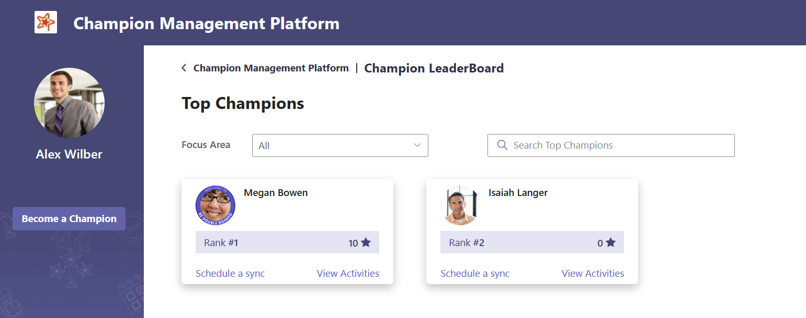

# Champion Management Platform 

## Introduction:
The Champion Management Platform is a custom Teams app that enables organizations to onboard and maintain champions/ SME in their organization in Teams, allowing everyone discover Champions right where they collaborate. Utilize this template for multiple scenarios, such as new initiative adoption, champion onboarding, or to maintain organization-wide Subject Matter Experts.

The app provides an easy interface for designated users to add members to the champion program, preview, collaborate and communicate and build a community of power users and coaches.  <br/>

                   

## How it works:

1.	The current version of the Champion Management Platform operates as an app in Microsoft Teams that is installed locally in your tenant by your tenant administrator or any user who has the capability to side load the application.
2.  Once installed, it can be accessed via “+Add a tab”  option at the top of the channel within a team. ***Channel > Add a tab > Champion Management Platform*** or from accessing the platform as a personal app on the left rail by ***Selecting "..." for more apps in left rail of Teams > searching for Champion Management Platform***
3.	The app installation process will create a SharePoint site “ChampionManagementPlatform” and SharePoint list (Members List ) in this site to store all users who are nominated to be a champion. Two additional lists(“Events List” and “Events Track Details”) are created to track the events and points. A local administrator is responsible for maintaining this SharePoint list. This person can be the individual who manages the Champion program for the organization or his/her delegate.
4.	The app provides an easy interface for approved employees (Champions) to showcase their Focus area, preview, collaborate and even add their colleagues as new champions.
5.	There are 3 major components in Champion Management Platform. 
..a.	Champion management
..b.	Leaderboard 
..c.	Digital badging
6.	The Champions will be earning points for hosting events, writing Blogs, moderating Office hours etc., Leaderboard ranks all the champions based on their points globally, regionally, and even by focus area.
7.	Point accumulation , ranking logic, Event details are configurable by the Admin based on the organization  needs. <br/>

 

### Champion Leaderboard:

Leaderboard solution is intended to add a gaming aspect to the Teams Champions program by allowing champions to earn points for the various ways they are promoting and supporting the internal adoption of their areas of interest. This also gives an opportunity to reflect their activity in comparison to other champs. Leaderboard has mainly 2 different views based on the role of that employee.
Roles can be categorized as: 
* i.	Admin/Moderator OR Champion
* ii.	Employee 


### Admin/Moderator OR Champion view
In our Champions program, Admin is a Champion by default.  The Champion view is to enable Administrator or Champions to identify all the members of the Champions program. 
<br/>

      


#### An Admin / Champion can do the following: 

1.	Access Champion Leaderboard
..a.	To view their current points total.
..b.	To view their Global rank and how they rank against others globally.
..c.	Access their dashboard with list of events they have supported.
..d.	Add and submit upcoming events to earn points associated with it.  Example, hosting office hours can earn 10 points, whereas writing a blog can earn 5 points. 
2.	 Nominate and approve an employee to be a champion (Add members ) 
..a.	An Admin can add employee as a Champion.
..b.	Where as an existing Champion can nominate their peers. Admin will review and approve the nomination.
3.	Earn a digital badge that can be displayed as an overlay on their profile image. *Refer to Digital Badge section. 

### Employee view
Leader board encourages the employees to get connected to the Champions in their organization.
1.	 Every employee can access the Champion Leader board.
2.	Through Champion Leaderboard, an Employee can identify all the Champions globally or can filter by a particular Focus area or by region option.
3.	Employee can also “Become a Champion” by submitting their information.
 <br/>

      
     
### Add Members 
Admin and current Champions of the program can nominate(***Add Members***) peers as Champions. Additional responsibility falls on the admin to maintain the Champions SharePoint list. *The approval process stays with the Admin only.*

The Admin can approve/Reject the champion nominations using Manage Approvals screen. 

### Digital Badge 
Digital Badge is intended to allow Microsoft 365 Champions to apply a ‘Champion’ badge on their profile image. It provides an easy and seamless process to share the recognition as a champion with the team.
 <br/>

 


### Prerequisites

Ensure the administrator who will install the app has access to following:

SharePoint Admin role 
- Permission to load application package into SharePoint Online
- Permission to approve API requests in SharePoint Online
- Ability to create a site in SharePoint Online

Once the package has been installed, API granted, and solution synced to Teams (steps documented below), the same admin will likely also be asked to complete the first run experience. This first run creates the SharePoint site (ChampionManagementPlatform)
that all assets of this solution will be created under. Additionaly permissions need to be modified by an owner of this site to include edit/contribute rights for the organizations ability to interact with the solution.

# Installation Types (Customized vs Standard)

## Customized Installation
The customized installation makes the assumption you wish to change the default variables (site location, text or visual aspects, etc) with the Champion Management Platform. Customizing the installation takes it outside of 
configurations we have tested against but allows you to modify any aspect of the platform. Below are high level steps to get you started on a customized installation.

### Install NodeJs

1.  Download nodejs from this link 
    https://nodejs.org/ 

2.   Previous Releases | Node.js (nodejs.org) 
    Download node 10.24.0

3.  After downloading the nodejs and installing follow steps as follows

4.  Please open the CMP download folder
    Run Npm install
    And 
    Run npm install -g gulp
    
  *	Global or SharePoint Administrator role in the target tenant
  *	***ChampionManagementPlatform*** project in GitHub
    
### Customize configuration

If desired the administrator can configure the installation location including the customized site, list, and/or column(s) using following steps:

1.	Update the ***"src/webparts/XXXXX/config/siteconfig.json"*** configuration file. Changing the values in the JSON file will customize the SharePoint list location and/or schema when it is created during deployment.
 <br/>

    
     

```
· inclusionPath (SharePoint inclusion path - e.g. sites or teams)

· sitename (SharePoint site name)

· list (SharePoint list for maintaining Champions)

· CName (SharePoint list Column Name for Champions)
```
<br/>

  
<br/>
  

2.	Create the SharePoint App Package. This package will be used to deploy the application in SharePoint and Microsoft Teams. Run the below commands :

```
· npm install 

· gulp build

· gulp bundle --ship

· gulp package-solution --ship
```

3.	Navigate to the solution folder where you cloned and locate the newly created ***cmp.sppkg*** package in ***"sharepoint/solution"***.


## Standard Installation
The standard installation assumes you would like to take the SharePoint package file located in our GitHub repository and install using the configuration outlined in this readme file (assets all created under a SharePoint site
called ChampionManagementPlatform as well as the default list names and all related teamwork champion terms within the application)

Continuing below steps you can take the cmp.sppkg file from the ***cmp.sppkg*** package in ***"sharepoint/solution"*** location of the GitHub repo here (or use the one customized for your organization if someone provided a customized file)

### Deploy your Package to SharePoint

1.	Open SharePoint and sign in using the administrator account. Click on the "dots" icon in the top left corner of the banner.
 <br/>

  
 <br/>
2.	Select Admin from the menu that appears.
 <br/>

  
 <br/>
3.	Select SharePoint from the menu that appears. You may need to click "... Show all" for the SharePoint entry to appear.
  <br/>

  
 <br/>
4.	You will be directed to the SharePoint admin center.
  <br/>

  
 <br/>
5.	Click on "More features" menu item. Locate the Apps section and click the ***Open*** button.
  <br/>

 
 <br/> 
6.	Click the ***App Catalog*** link.
  <br/>

  
 <br/>
*If you do not see an app catalog available, use the instructions <a href='https://docs.microsoft.com/en-us/sharepoint/use-app-catalog#step-1-create-the-app-catalog-site-collection' target="_blank">here</a> to create a new app catalog before continuing.*

7.	Click the ***Distribute apps for SharePoint*** link.
  <br/>

 
<br/>
8.	Click the ***New*** menu item
  <br/>

 
<br/>
9.	Click the ***Choose Files*** button, select the ***cmp.sppkg*** file you downloaded or created earlier, and click on ***OK***
 <br/>

 
<br/>
10.	A confirmation dialog is displayed. Ensure the checkbox for "Make this solution available to all sites in the organization" is chosen and click ***Deploy***.
  <br/>

 
<br/>
11.	Return to the ***SharePoint admin center***. Under expand the ***Advanced*** menu in the left navigation and select ***API access***. Select and approve all pending requests associated with ***championmanagement***
  <br/>

 
<br/>
12.	Return to app list in the App Catalog and select the ***championmanagement*** app. Select the Files tab in the ribbon and click the ***Sync to Teams*** button.
  <br/>

 
<br/>

### First Run Experience:Add ***Champion Management Platform*** Tab in Teams

1.	Navigate to Microsoft teams, select the Team and channel where you want to install Champion Management Platform. Click ***Add a tab***, choose ***Champion Management Platform*** from the app list, and Save. (Search for Champion)

Alternately you can also add the Champion Management Platform as a personal app in the left side rail by selecting the “...” and searching for Champion Management Platform, and then selecting add. 
 
This first run experience needs to be completed by the person who will be an admin of the platform, as it is this experience that creates the initial resources (SPO site + assets (3 lists mentioned above). This user that completes the first run is added as a manager of the platform. Alternately you may need a SharePoint admin to run the first run so the site is created and then have them add you as a manager of the platform once the assets have been created. 


  <br/>

 

2. Click 'Add' to create the ***'Champion Management Platform'*** tab to your Teams (Alternately you can also just load the app as a personal app in the left rail here too).
3. The landing page for an Admin will have access to the *Champion Leaderboard, Digital Badge* application, and the SharePoint lists(*Champions, Events,Event track Details*), as well as Manage Approvals.
  <br/>

 
4. Grant Permissions to users:

· Navigate to the URL for the Champion Management Platform site as the administrator. 

· If you are using the default configuration, this can be found at ***`https://<yourtenant>.sharepoint.com/sites/ChampionManagementPlatform/`***.

- Select site permissions

- Advanced permissions settings

- Select Grant permissions 
 
<br/>

 

  . Select Share <br/>
  . Enter in 'Everyone except external users'<br/>
  . Change permissions to Edit<br/>
  . Unselect send email<br/>
  . Press share<br/>
  

 <br/>

 

### Teams Personal App:

CLbHomeWebPart.manifest.json is updated with a new entry, TeamsPersonalApp  

 

### Completed Install
Once you have performed the above steps, the deployment of the Champion Management Platform is now complete. If an admin was deploying this on behalf of the manager of the Champion Management Platform please have the admin add the
Champion Management Platform manager as a champion and change their role in the Memberlist from ***Champion*** to ***Manager*** so they will have access to the other parts of the platform.

### Updated in version 1.3.0.0

1. Improved App installation process to fix issues while installing the app.
2. Upgraded NPM packages to recommended version for better performance, security and latest fixes.
3. Fixed an issue where the App is not working as expected when more than 100 champions are added to the system.
4. Fixed an issue with incorrect rank of current user being displayed on the side bar under Leaderboard screen.
  

### Updated in version 1.2.0.0

1.	'Member List' is now created right under 'ChampionManagementPlatform' site. This was created in the root site in version 1.1.0.0
2.	'Manage Approvals' functionality is added to the App. The Admins can now see additional feature in the home page 'Manage Approvals'. This screen can be used by the admins to Approve/Reject the champion nominations easily. 
<br/>

 
 
3.	Column type for 'Description' is modified to 'Single line of text' from 'Choice'
4.	'Member Name' and 'Event Name' columns are added to 'Event Track List' SharePoint list.

### Upgrade to version 1.3.0.0 from 1.2.0.0

If you are already having version 1.2.0.0 installed on your tenant follow the below steps to upgrade:

1.  Navigate to App Catalog with a tenant Admin account. Do not delete the existing 1.2.0.0 package.Upload the new package that is downloaded from "sharepoint/solution" folder which will replace the existing package.  

 

2. Click on "Deploy".

 

3. "Check In" the package.

 

4. Select the package and click "Sync to Teams" from the ribbon and wait for the "Successfully synced to teams solution" message to appear

 

5. The Champion Management Platform will be updated to the latest version and you will see changes reflected in Teams. Please note that if you do not see changes reflected in Teams after 30 minutes you can log out and back in and clear the Teams cache to see changes immediately. 

### Upgrade to version 1.3.0.0 from 1.1.0.0

If you are already having 1.1.0.0 installed on your tenant and want to upgrade to 1.3.0.0 the existing app and SharePoint site 'ChampionManagementSite' have to be deleted. 

If you have current members and events you will want to export those list items and import re-import them into the respective list areas. We have expanded our lists to have some additional data as well so you may need to populate additional fields. 

Memberlist (same information) 
EventList (same information) 
EventTrackDetails (added two colums to contain event name + member name) 

Follow the below steps to upgrade your install and optionally also export and import the data you may already have for the program. 

1.	Delete the existing App from Teams.
<br/>

 

 
2.	Delete 'Members List' from root site. <br/>
    a. Remember to export members if you are wanting to import the members back in 
3.	Delete 'ChampionManagementPlatform' Sharepoint site from both 'Active Sites' and 'Deleted Sites'.

    a. Remember to export the Event List and Event Track List if you are wanting to import the events details back in. 

<br/>

 
 
4. Delete 'cmp.sppkg' from App Catalog.	
5. Startover the installation of new package following instructions from the section 'Standard Installation' of this document.
6. Once the install has completed and first run is done, you can visit the site assets of the ChampionManagementPlatform and import any of the exported Champion data


### Known issues

1) If site is presenting with spinning blue circle check to ensure permissions are allowed to the ChampionManagementPlatform sharepoint site. If this is happening on the first load experience ensure that the user running first run experience has permissions to create a SharePoint site (first run creates the initial ChampionManagementPlatform site).If you continue to experience the blue circle, please remove the app from Teams and try again. Visit our issues list to log an issue if issue is still persistent. 

<br/>

2) If new users visit the Champion Management Platform app and receive a blue spinning circle, ensure that you have granted contribute/edit permissions to the SharePoint site created during first run to all users (or scoped users accessing the app). The default site created is ChampionManagementPlatform.

### Frequently Asked Questions

FAQ:


Q. Can we Install in existing site?

A. To maintain permissions and access control, current version of CMP is creating a new site. If you wish to install to a specific existing site you can download the source code and modify the location of SharePoint site the package installs to. This would require a recompile of the package.

Q.Why is profile image not updated with Digital Badge?

A.This happens when the permissions are not being inherited or approved after deploying package. The users must be able to update their profile images and Graph API permissions must have also been approved during package install. 


### Additional Customization Options

The Champion Management Platform is built to provide a great starting point for managing your program. There are several ways you can modify the solution to fit your needs, with some of the major customizations in this current release coming from modifying list and column options once the solution has been deployed. Common actions include:

. Expanding the list of regions / countries / Focus Area / Groups to fit your criteria. Lists provide a very flexible way to provide data points for collection. While we have provided some starter data you will want to modify these values as they are reflected in the Add Members section. This action is done from selecting the list you would like to edit (champion list for this example), selecting the drop down on the column, then navigating to Column settings -> Edit.
<br/>

 

. You could take similar actions in other lists to modify or add in event types and manual counts for activity logging.
<br/>

 
 
### Legal

This app template is provided under the MIT License terms. In addition to these terms, by using this app template you agree to the following:

· You are responsible for complying with all applicable privacy and security regulations related to use, collection, and handling of any personal data by your app. This includes complying with all internal privacy and security policies of your organization if your app is developed to be sideloaded internally within your organization.

· Where applicable, you may be responsible for data related incidents or data subject requests for data collected through your app.

· Any trademarks or registered trademarks of Microsoft in the United States and/or other countries and logos included in this repository are the property of Microsoft, and the license for this project does not grant you rights to use any Microsoft names, logos or trademarks outside of this repository. Microsoft's general trademark guidelines can be found [here](https://www.microsoft.com/en-us/legal/intellectualproperty/trademarks/usage/general.aspx).

· Use of this template does not guarantee acceptance of your app to the Teams app store. To make this app available in the Teams app store, you will have to comply with the [submission and validation process](https://docs.microsoft.com/en-us/microsoftteams/platform/concepts/deploy-and-publish/appsource/publish), and all associated requirements such as including your own privacy statement and terms of use for your app.

**Contributing**

This project welcomes contributions and suggestions. Most contributions require you to agree to a Contributor License Agreement (CLA) declaring that you have the right to, and actually do, grant us the rights to use your contribution. For details, visit https://cla.microsoft.com.

When you submit a pull request, a CLA-bot will automatically determine whether you need to provide a CLA and decorate the PR appropriately (e.g., label, comment). Simply follow the instructions provided by the bot. You will only need to do this once across all repos using our CLA. This project has adopted the Microsoft Open Source Code of Conduct. For more information see the Code of Conduct FAQ or contact opencode@microsoft.com with any additional questions or comments.

###Disclaimer###

THIS CODE IS PROVIDED AS IS WITHOUT WARRANTY OF ANY KIND, EITHER EXPRESS OR IMPLIED, INCLUDING ANY IMPLIED WARRANTIES OF FITNESS FOR A PARTICULAR PURPOSE, MERCHANTABILITY, OR NON-INFRINGEMENT.
