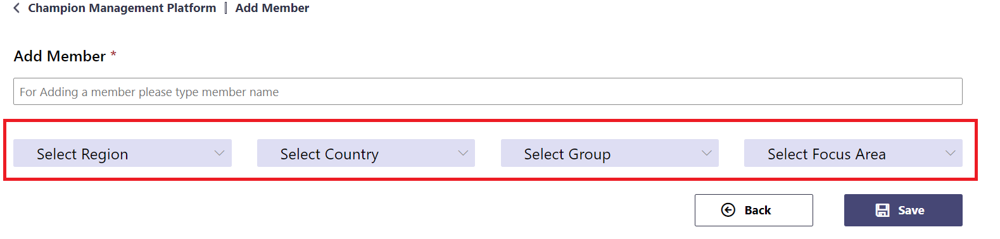
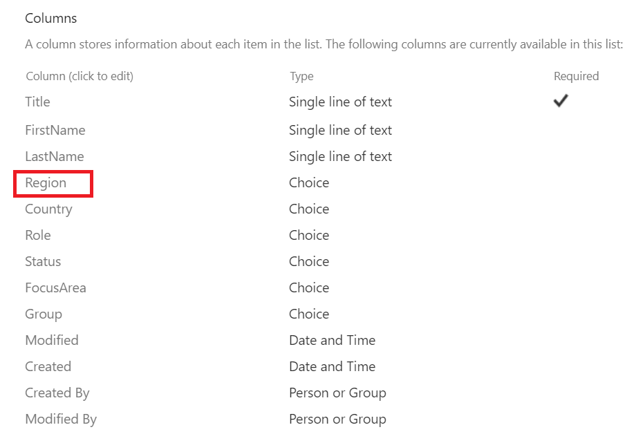

# Customizations

The customized installation makes the assumption you wish to change the default variables (site name, list names, labels, buttons text, logo etc.) with the CMP Solution Template. Customizing the installation takes it outside of configurations we have tested against but allows you to modify any aspect of the template. 

```
Please note that if you customize the solution according to your organization needs, there are chances that you might face challenges while upgrading to new versions with the future releases.
```

## Prerequisites 

1. Install Visual Studio Code
1. Clone the app [repository](https://github.com/OfficeDev/microsoft-teams-apps-champion-management.git) locally.

Below are the high level steps to get you started on customizing the template.

## Site Name Customization

1.  Open `siteconfig.json` under `src\webparts\clbHome\config` 
1.  Modify the 'sitename' property as per your requirement.
    
         

    
## List Names and Field Names Customization

1. Open `siteconfig.json` under `src\webparts\clbHome\config` 
1. To modify a list name change the "listName" property of the specific list.
1. To modify a field name change the "name" property under the "columns" node.
1. Modify the code in the component which is linked to the list/field and test to make sure the functionality is not breaking.

         

## Button/Label/Title text customization

1. Open `en-us.js` under `src\webparts\clbHome\loc` 
1. The text for all buttons, labels,titles, messages are listed in this file grouped by components.
1. Find and modify the text as per needs.

         

## Disable/Modify "Become a champion" on Leader Board for non champions

1. Open `Sidebar.tsx` under `src\webparts\clbHome\components`.
1. Find the "Become a champion" button code.

    

1. Modify the disabled property to "disabled={true}"
1. To redirect the button to a different component/page modify the "onClick" property of the button as needed

## Customize the app logo from manifest

1. Navigate to `teams` folder under the project.

      

1. Replace the below two images with new image files. Make sure the new images are also in png format.
6df47bd5-d84a-41ab-8c4a-9352076e8b6c_color.png
6df47bd5-d84a-41ab-8c4a-9352076e8b6c_outline.png
1. Delete the "TeamsSPFxApp.zip" folder and create a new zip folder with the images and the manifest file in the same location with the same name.
1. Generate a new package file and follow the deployment instructions in the deployment guide.

## Customize Member List attributes

1. The values for the dropdown lists in the "Add Member" component can be customized.

      

1. To add/modify values for these dropdowns navigate to "ChampionManagementPlatform" SharePoint site.
1. Go to Settings page of SharePoint list "Member List".
1. Find the column that you want to add/modify values of. For ex: To add a new region click on "Region" column

      

1. Add/Modify the values as shown below and click "Save"

      

1. Repeat the steps for other columns that needs to be modified.