# Customizations

The customized installation makes the assumption you wish to change the default variables (site name, list names, labels, buttons text, logo etc.) with the CMP Solution Template. Customizing the installation takes it outside of configurations we have tested against but allows you to modify any aspect of the template. 

```
Please note that if you customize the solution according to your organization needs, there are chances that you might face challenges while upgrading to new versions with the future releases.
```

## Prerequisites 

1. Install Visual Studio Code
1. Clone the app [repository](https://github.com/OfficeDev/microsoft-teams-apps-champion-management.git) locally.

Below are the high level steps to get you started on customizing the template.

## Site Name Customization

1.  Open `siteconfig.json` under `src\webparts\clbHome\config` 
1.  Modify the 'sitename' property as per your requirement.
    
    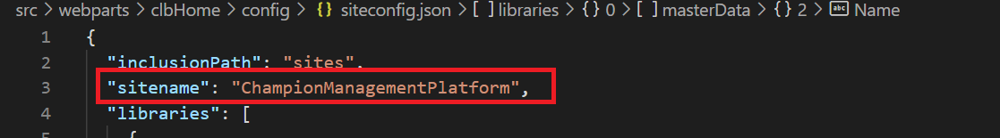     

    
## List Names and Field Names Customization

1. Open `siteconfig.json` under `src\webparts\clbHome\config` 
1. To modify a list name change the "listName" property of the specific list.
1. To modify a field name change the "name" property under the "columns" node.
1. Modify the code in the component which is linked to the list/field and test to make sure the functionality is not breaking.

    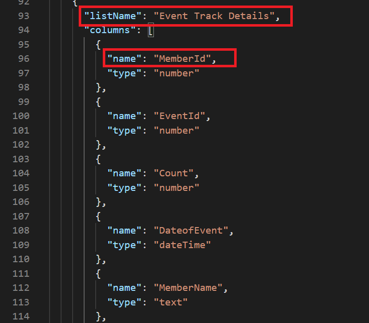     

## Button/Label/Title text customization

1. Open `en-us.js` under `src\webparts\clbHome\loc` 
1. The text for all buttons, labels,titles, messages are listed in this file grouped by components.
1. Find and modify the text as per needs.

    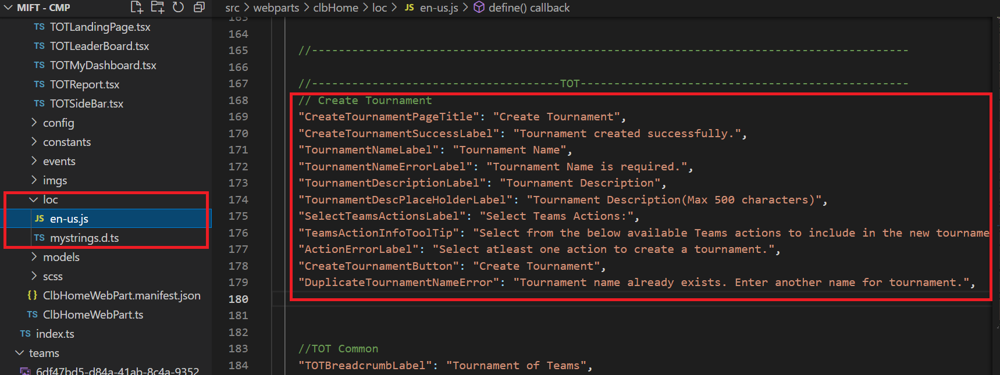     

## Disable/Modify "Become a champion" on Leader Board for non champions

1. Open `Sidebar.tsx` under `src\webparts\clbHome\components`.
1. Find the "Become a champion" button code.

    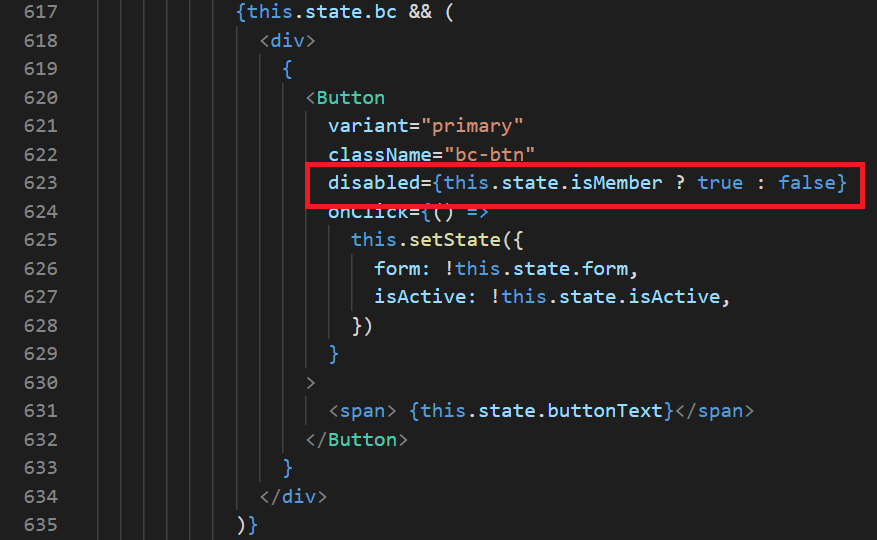

1. Modify the disabled property to "disabled={true}"
1. To redirect the button to a different component/page modify the "onClick" property of the button as needed

## Customize the app logo from manifest

1. Navigate to `teams` folder under the project.

    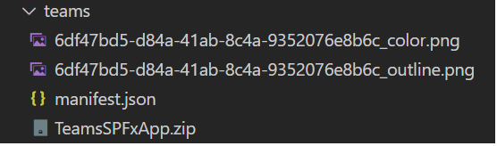  

1. Replace the below two images with new image files. Make sure the new images are also in png format.
6df47bd5-d84a-41ab-8c4a-9352076e8b6c_color.png
6df47bd5-d84a-41ab-8c4a-9352076e8b6c_outline.png
1. Delete the "TeamsSPFxApp.zip" folder and create a new zip folder with the images and the manifest file in the same location with the same name.
1. Generate a new package file and follow the deployment instructions in the deployment guide.

## Customize the App Title

1. Follow the steps from `Standard Installation` section in the Deployment Guide. If you are having classic App Catalog skip the step 12 and if you are having modern App Catalog skip the step 4 under `Modern App Catalog` section.
1. Instead of syncing the app to Teams through App Catalog follow the below steps.

1. Download the folder `teams` from the app [repository](https://github.com/OfficeDev/microsoft-teams-apps-champion-management.git) locally.

1. Open `teams` folder locally and open the `manifest.json` file and make the below changes. 

   - To change the App title as it appears in App Store, modify the below properties in the manifest file
     * name
     * description 
     <br /> 
NOTE: Make sure the App Title doesn't exceed 30 characters.

    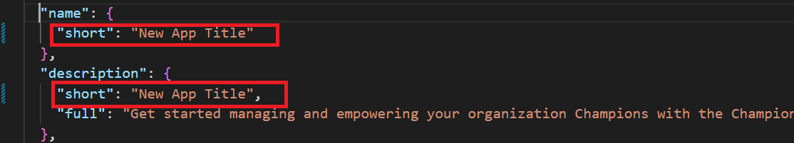  
    
   - To change the App title as it appears on the tab, modify the below property in the manifest file
     * staticTabs
<br/><br/>
    
    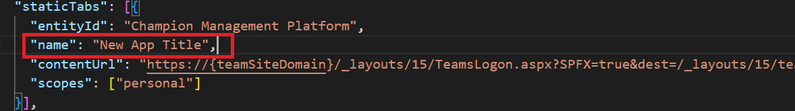  

1. Delete the `TeamsSPFxApp.zip` folder and create a new zip folder with the 2 images and the manifest file in the same location with exactly the same name `TeamsSPFxApp.zip`.

1. Navigate to `Teams Admin Center` and upload the `TeamsSPFxApp.zip` zip file. The title changes to the app will take effect in Teams as shown below.

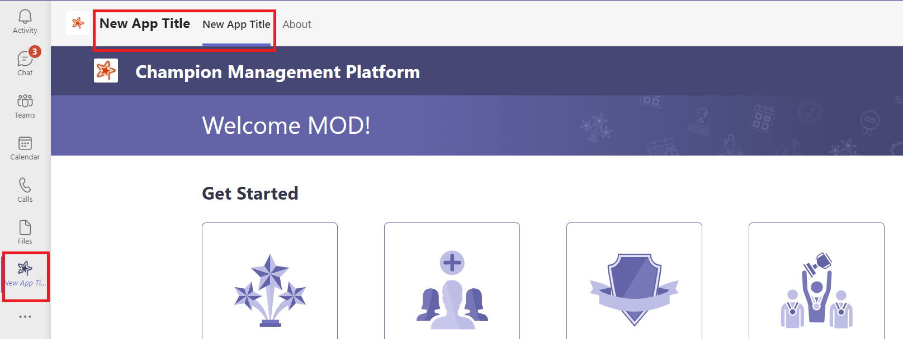  

## Customize Member List

Below customizations can be done in the Member list with no code changes required in the solution.

1. Modify the display name for the below columns
    - Region
    - Country
    - Group
    
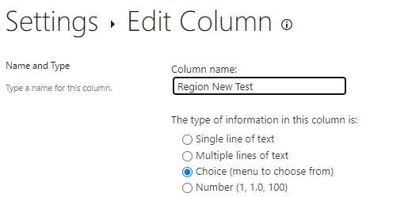 

>**Note:** Change column names only when your SharePoint site is displayed in English (i.e. The language setting for the user in office 365 profile (Delve) should be English). This is a limitation based on how the column renaming works in non-English languages.

2. Admin can Show/Hide the below columns from "Manage Config Settings" under Admin Tasks.
    - Region
    - Country
    - Group

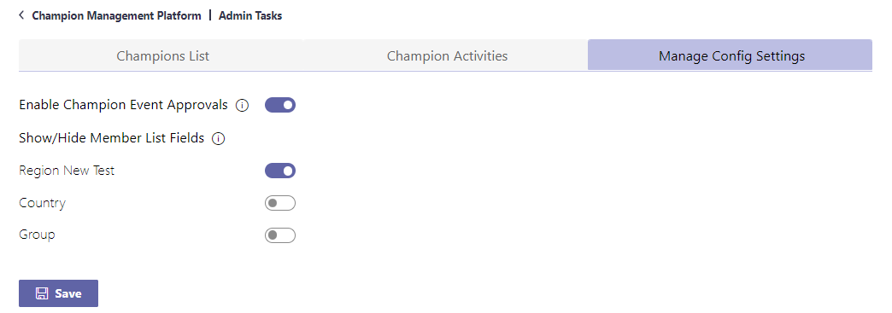 

For eg: If any of these column is no longer needed for the app, it can configured in the above screen and it will be hidden throughout the app screens where it was used.

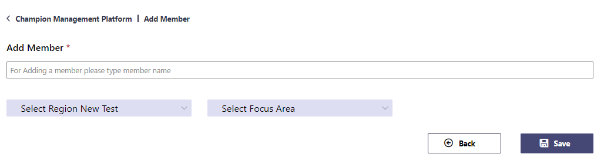 

3. Add/Modify the choices for the below columns
    - Region
    - Country
    - Group
    - Focus Area

    

>**Important Note:**
1. Do not delete or change the type of any column in the "Member List".
1. Do not make any customization other than the above listed items, unless you are customizing the code. Otherwise it will break the functionality of the app.