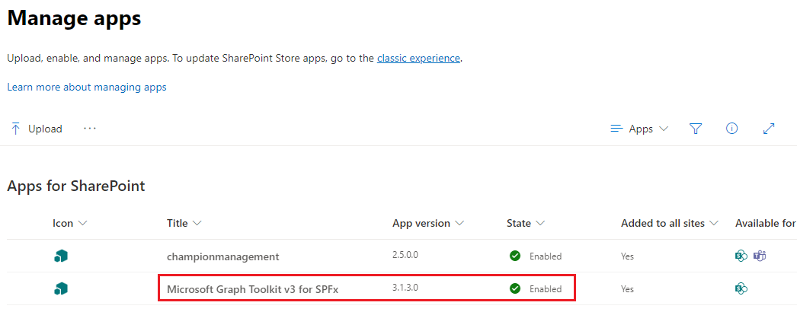
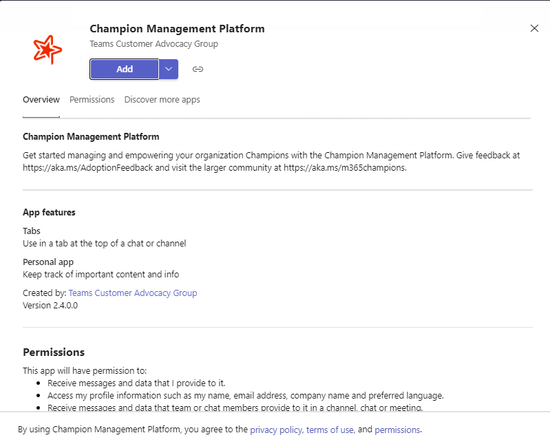
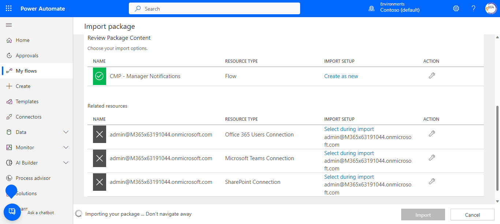
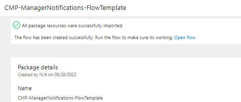
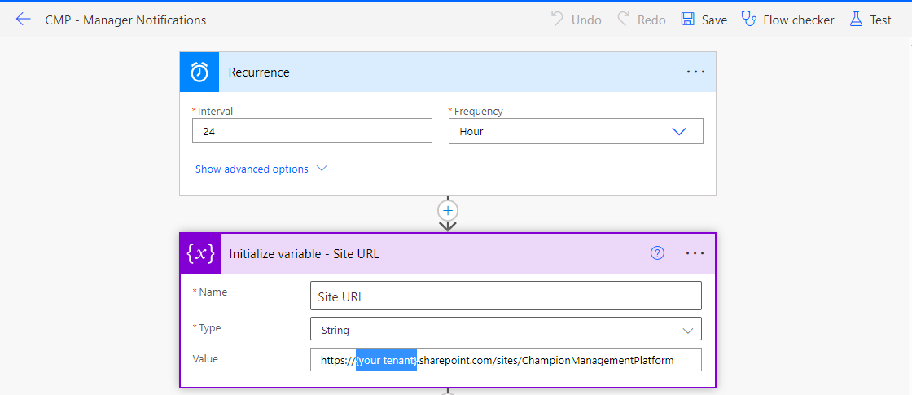

# Installation Types (Standard vs Customized)

## Standard Installation
The standard installation assumes you would like to take the SharePoint package file located in our GitHub repository and install using the configuration outlined in this readme file (assets all created under a SharePoint site
called ChampionManagementPlatform as well as the default list names and all related teamwork champion terms within the application)

Continuing below steps you can take the cmp.sppkg file from the ***cmp.sppkg*** package in ***"sharepoint/solution"*** location of the GitHub repo here (or use the one customized for your organization if someone provided a customized file)

### Deploy your Package to SharePoint

**NOTE:** If you have just created a new tenant please wait for around 15 minutes before starting with the below steps.

1.	Open SharePoint and sign in using the administrator account. Click on the "dots" icon in the top left corner of the banner.

     

2.	Select Admin from the menu that appears.

     

3.	Select SharePoint from the menu that appears. You may need to click "... Show all" for the SharePoint entry to appear.

     

4.	You will be directed to the SharePoint admin center.

     

5.	Click on "More features" menu item. Locate the Apps section and click the ***Open*** button.

    

6.	Click the ***App Catalog*** link.

     

*If you do not see an app catalog available, use the instructions <a href='https://docs.microsoft.com/en-us/sharepoint/use-app-catalog#step-1-create-the-app-catalog-site-collection' target="_blank">here</a> to create a new app catalog before continuing.*

 NOTE: If you are using/seeing modern app catalog refer to the go to the [Modern App Catalog](#modern-app-catalog) section.

7.	Click the ***Distribute apps for SharePoint*** link.

     

8.	Click the ***New*** menu item

     

9.	Click the ***Choose Files*** button, select the ***cmp.sppkg*** file you downloaded or created earlier, and click on ***OK***

     

10.	A confirmation dialog is displayed. Ensure the checkbox for "Make this solution available to all sites in the organization" is chosen and click ***Deploy***.

    

11.	select the ***championmanagement*** app. Select the Files tab in the ribbon and click the ***Sync to Teams*** button.

     

12. Repeat steps 8-10 to deploy another package "mgt-spfx-vv3.sppkg" to the App catalog. This package can be picked from ***"sharepoint/solution"*** location of the GitHub repo here. This package is required for the person card feature when hovering over a champion name in the app.

         

13.	Return to the ***SharePoint admin center***. Under expand the ***Advanced*** menu in the left navigation and select ***API access***. Select and approve all pending requests associated with ***championmanagement***.

    **User.ReadWrite** : Allows the app to read the signed-in user's full profile. It also allows the app to update the signed-in user's profile information on their behalf. CMP app uses this permission to read and update the user's profile image with the digital badge.

    **User.Read.All** : Allows the app to read the full set of profile properties, reports, and managers of other users in your organization, on behalf of the signed-in user. CMP uses this permission to display person cards for all champions.

    **People.Read**: Allows the app to read a scored list of people relevant to the signed-in user. The list can include local contacts, contacts from social networking or your organization's directory, and people from recent communications. CMP uses this permission to display person cards for all champions.

     


### Modern App Catalog 

``` This section applies only if you are using/seeing modern app catalog.```

1. Click on "Upload" under "Manage Apps" and upload the package file.

    

1. After uploading the package, select "Enable this app and add it to all sites" and click on "Enable App"

    

1. Click on "Go to API access page" to approve the permissions. Refer to step 13 from previous section for details. 

    

1. Once done, click on "Add to Teams" to make this app available in Teams. Sometimes you may see an error after clicking "Add to Teams". Navigate to "Manage Apps" in Teams Admins center to verify if the ChampionManagementPlatform is created. If yes, you can ignore the error and proceed.

    

1. Repeat steps 1-2 to deploy another package file "mgt-spfx-vv3.sppkg" to the App catalog by selecting "Enable this app and it to all sites" option. This package can be picked from ***"sharepoint/solution"*** location of the GitHub repo here. This package is required for the person card feature when hover over a champion name in the app.

        

## Customized Installation

The customized installation makes the assumption you wish to change the default variables (site location, text or visual aspects, etc) with the Champion Management Platform. Customizing the installation takes it outside of 
configurations we have tested against but allows you to modify any aspect of the platform. Below are high level steps to get you started on a customized installation.

### Prerequisites 

1. [Set up your development environment](https://learn.microsoft.com/en-us/sharepoint/dev/spfx/set-up-your-development-environment)
1. Clone the app [repository](https://github.com/OfficeDev/microsoft-teams-apps-champion-management.git) locally.

Below are the high level steps to get you started on a customizing the template.

### Install NodeJs

1.  Download nodejs from this link 
    https://nodejs.org/en/download/releases/ 

2.  Previous Releases | Node.js (nodejs.org) 
    Download node 16.18.0

3.  After downloading and installing the nodejs and installing follow steps as follows

4.  Open the CMP solution in VS Code.

    run npm install

    run npm install -g gulp
    
  *	Global or SharePoint Administrator role in the target tenant
  *	***ChampionManagementPlatform*** project in GitHub
    
### Customize configuration

If desired the administrator can configure the installation location including the customized site, list, and/or column(s) using following steps:

1.	Update the ***"src/webparts/XXXXX/config/siteconfig.json"*** configuration file. Changing the values in the JSON file will customize the SharePoint list location and/or schema when it is created during deployment.

     

```
· inclusionPath (SharePoint inclusion path - e.g. sites or teams)

· sitename (SharePoint site name)

· list (SharePoint list for maintaining Champions)

· CName (SharePoint list Column Name for Champions)
```

  

  

2.	Create the SharePoint App Package. This package will be used to deploy the application in SharePoint and Microsoft Teams. Run the below commands :

```
· npm install 

· gulp build

· gulp bundle --ship

· gulp package-solution --ship
```

3.	Navigate to the solution folder where you cloned and locate the newly created ***cmp.sppkg*** package in ***"sharepoint/solution"***.

4. Follow the instructions in the previous sections of this deployment guide to deploy the custom package. 

## First Run Experience: Add **Champion Management Platform** Tab in Teams

**NOTE:** Please wait for around 20 minutes for API access approvals done in the previous section to take effect before proceeding with the below steps.

1.	Navigate to Microsoft teams, select the Team and channel where you want to install Champion Management Platform. Click ***Add a tab***, choose ***Champion Management Platform*** from the app list, and Save. (Search for Champion)

    Alternately you can also add the Champion Management Platform as a personal app in the left side rail by selecting the “...” and searching for Champion Management Platform, and then selecting add. 
 
    This first run experience needs to be completed by the person who will be an admin of the platform, as it is this experience that creates the initial resources (SPO site + assets (3 lists mentioned above). This user that completes the first run is added as a manager of the platform. Alternately you may need a SharePoint admin to run the first run so the site is created and then have them add you as a manager of the platform once the assets have been created. 

     

2. Click 'Add' to create the ***'Champion Management Platform'*** tab to your Teams (Alternately you can also just load the app as a personal app in the left rail here too).

3. After clicking on 'Add', the app set up will start and you will see a spinner as shown below. The set up may take around 1-2 minutes.

    

4. After the set up is complete a success message is shown as below. The below snapshot is from Teams in browser. The same message would look different in Teams client.

    

5. On clicking 'OK' the landing page is displayed.

    

6. If you still see the spinner message and do not see the success message even after 2 minutes or if you see any error alerts, try clicking on refresh icon on top right. If you see the landing page with all the icons shown in the above picture the app set up is complete.

    

    If you still do not see the landing page after refresh please create an issue in the GitHub.

7. The landing page for an Admin will have access to the *Champion Leaderboard, Digital Badge, Enable Tournament of Teams* and the SharePoint lists (*Champions, Events,Event track Details, Digital Badges*), as well as Admin Tasks.

     

8. Grant Permissions to users:

  - Navigate to the URL for the Champion Management Platform site as the administrator. 

  - If you are using the default configuration, this can be found at ***`https://<yourtenant>.sharepoint.com/sites/ChampionManagementPlatform/`***.

    - Select site permissions

    - Advanced permissions settings

    - Select Grant permissions 

       

  - Select Share 

  - Enter in 'Everyone except external users'

  - Change permissions to Edit

  - Unselect send email

  - Press share

     


### Completed Install

Once you have performed the above steps, the deployment of the Champion Management Platform is now complete. If an admin was deploying this on behalf of the manager of the Champion Management Platform please have the admin add the
Champion Management Platform manager as a champion and change their role in the Member List from ***Champion*** to ***Manager*** so they will have access to the other parts of the platform.

### Enable Tournament of Teams

Click on "Enable Tournament of Teams" on CMP home page to enable the Tournament of Teams. Refer to "Tournament of Teams" section for additional details.

 

### Import flow template in Power Automate (Optional Enhancement)

If you enable the Champion Event Approvals in the CMP App, then do configure the Power Automate Flow template in the tenant to send notifications to the CMP Manager at regular intervals if there are any pending event requests available.

1. To import the Power Automate flow template in your tenant, make sure you have cloned the app [repository](https://github.com/OfficeDev/microsoft-teams-apps-champion-management.git) locally.  
2. Get the .zip package file `CMP-ManagerNotifications-FlowTemplate` under **ManagerNotifications** folder.  
3. Navigate to the Power Automate site in your tenant.
4. From the left navigation, Select "My Flows" --> "Import" --> "Import Package (Legacy)"
5. Choose and upload the `CMP-ManagerNotifications-FlowTemplate.zip` package.
6. Select the connection for the Resource Types. Click on "Select during Import" under Import Setup for each resource type and choose the connection. If the connection is not already available, create one for that resource type and then choose it.
7. After selecting the connections for all the 3 resources, click on Import.

    

8. Once the package is successfully imported, navigate to the edit flow screen by clicking on "Open flow" link as shown in the below image or you can navigate through "My Flows" --> Select the imported flow --> Choose "Edit".

    

9. Update your tenant name for the placeholder in the SharePoint site URL that is highlighted in below image. Additionally, you can update the interval for the flow trigger as per the need (by default it is set to 24 hours)

    

10. Save the flow then navigate to "My Flows", select the flow and turn on it.

    

### Approval Notifications for the Manager

After the flow is configured in the tenant, it will send a adaptive card notification to all the CMP Managers at regular configured interval, if there are any pending event requests available.


