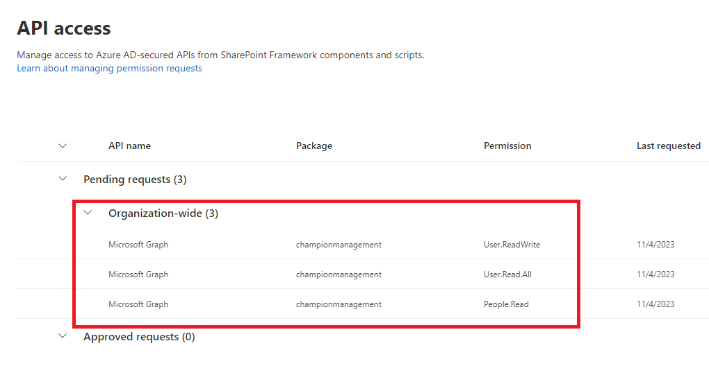

# Installation Types (Customized vs Standard)

## Customized Installation
The customized installation makes the assumption you wish to change the default variables (site location, text or visual aspects, etc) with the Champion Management Platform. Customizing the installation takes it outside of 
configurations we have tested against but allows you to modify any aspect of the platform. Below are high level steps to get you started on a customized installation.

### Install NodeJs

1.  Download nodejs from this link 
    https://nodejs.org/ 

2.   Previous Releases | Node.js (nodejs.org) 
    Download node 10.24.0

3.  After downloading the nodejs and installing follow steps as follows

4.  Please open the CMP download folder
    Run Npm install
    And 
    Run npm install -g gulp
    
  *	Global or SharePoint Administrator role in the target tenant
  *	***ChampionManagementPlatform*** project in GitHub
    
### Customize configuration

If desired the administrator can configure the installation location including the customized site, list, and/or column(s) using following steps:

1.	Update the ***"src/webparts/XXXXX/config/siteconfig.json"*** configuration file. Changing the values in the JSON file will customize the SharePoint list location and/or schema when it is created during deployment.
 <br/>

     

```
· inclusionPath (SharePoint inclusion path - e.g. sites or teams)

· sitename (SharePoint site name)

· list (SharePoint list for maintaining Champions)

· CName (SharePoint list Column Name for Champions)
```
<br/>

  
<br/>
  

2.	Create the SharePoint App Package. This package will be used to deploy the application in SharePoint and Microsoft Teams. Run the below commands :

```
· npm install 

· gulp build

· gulp bundle --ship

· gulp package-solution --ship
```

3.	Navigate to the solution folder where you cloned and locate the newly created ***cmp.sppkg*** package in ***"sharepoint/solution"***.


## Standard Installation
The standard installation assumes you would like to take the SharePoint package file located in our GitHub repository and install using the configuration outlined in this readme file (assets all created under a SharePoint site
called ChampionManagementPlatform as well as the default list names and all related teamwork champion terms within the application)

Continuing below steps you can take the cmp.sppkg file from the ***cmp.sppkg*** package in ***"sharepoint/solution"*** location of the GitHub repo here (or use the one customized for your organization if someone provided a customized file)

### Deploy your Package to SharePoint

1.	Open SharePoint and sign in using the administrator account. Click on the "dots" icon in the top left corner of the banner.
 <br/>

  
 <br/>
2.	Select Admin from the menu that appears.
 <br/>

  
 <br/>
3.	Select SharePoint from the menu that appears. You may need to click "... Show all" for the SharePoint entry to appear.
  <br/>

  
 <br/>
4.	You will be directed to the SharePoint admin center.
  <br/>

  
 <br/>
5.	Click on "More features" menu item. Locate the Apps section and click the ***Open*** button.
  <br/>

 
 <br/> 
6.	Click the ***App Catalog*** link.
  <br/>

  
 <br/>
*If you do not see an app catalog available, use the instructions <a href='https://docs.microsoft.com/en-us/sharepoint/use-app-catalog#step-1-create-the-app-catalog-site-collection' target="_blank">here</a> to create a new app catalog before continuing.*

7.	Click the ***Distribute apps for SharePoint*** link.
  <br/>

 
<br/>
8.	Click the ***New*** menu item
  <br/>

 
<br/>
9.	Click the ***Choose Files*** button, select the ***cmp.sppkg*** file you downloaded or created earlier, and click on ***OK***
 <br/>

 
<br/>
10.	A confirmation dialog is displayed. Ensure the checkbox for "Make this solution available to all sites in the organization" is chosen and click ***Deploy***.
  <br/>

 
<br/>
11.	Return to the ***SharePoint admin center***. Under expand the ***Advanced*** menu in the left navigation and select ***API access***. Select and approve all pending requests associated with ***championmanagement***
  <br/>

 
<br/>
12.	Return to app list in the App Catalog and select the ***championmanagement*** app. Select the Files tab in the ribbon and click the ***Sync to Teams*** button.
  <br/>

 
<br/>

### First Run Experience:Add ***Champion Management Platform*** Tab in Teams

1.	Navigate to Microsoft teams, select the Team and channel where you want to install Champion Management Platform. Click ***Add a tab***, choose ***Champion Management Platform*** from the app list, and Save. (Search for Champion)

Alternately you can also add the Champion Management Platform as a personal app in the left side rail by selecting the “...” and searching for Champion Management Platform, and then selecting add. 
 
This first run experience needs to be completed by the person who will be an admin of the platform, as it is this experience that creates the initial resources (SPO site + assets (3 lists mentioned above). This user that completes the first run is added as a manager of the platform. Alternately you may need a SharePoint admin to run the first run so the site is created and then have them add you as a manager of the platform once the assets have been created. 


  <br/>

 

2. Click 'Add' to create the ***'Champion Management Platform'*** tab to your Teams (Alternately you can also just load the app as a personal app in the left rail here too).
3. The landing page for an Admin will have access to the *Champion Leaderboard, Digital Badge, Enable Tournament of Teams* and the SharePoint lists (*Champions, Events,Event track Details, Digital Badges*), as well as Manage Approvals.
  <br/>

 
4. Grant Permissions to users:

· Navigate to the URL for the Champion Management Platform site as the administrator. 

· If you are using the default configuration, this can be found at ***`https://<yourtenant>.sharepoint.com/sites/ChampionManagementPlatform/`***.

- Select site permissions

- Advanced permissions settings

- Select Grant permissions 
 
<br/>

 

- Select Share <br/>
- Enter in 'Everyone except external users'<br/>
- Change permissions to Edit<br/>
- Unselect send email<br/>
- Press share<br/>
  

 <br/>

 

### Teams Personal App:

CLbHomeWebPart.manifest.json is updated with a new entry, TeamsPersonalApp  

 

### Completed Install
Once you have performed the above steps, the deployment of the Champion Management Platform is now complete. If an admin was deploying this on behalf of the manager of the Champion Management Platform please have the admin add the
Champion Management Platform manager as a champion and change their role in the Memberlist from ***Champion*** to ***Manager*** so they will have access to the other parts of the platform.

### Enable Tournament of Teams

Click on "Enable Tournament of Teams" on CMP home page to enable the Tournament of Teams. Refer to "Tournament of Teams" section for additional details.

 