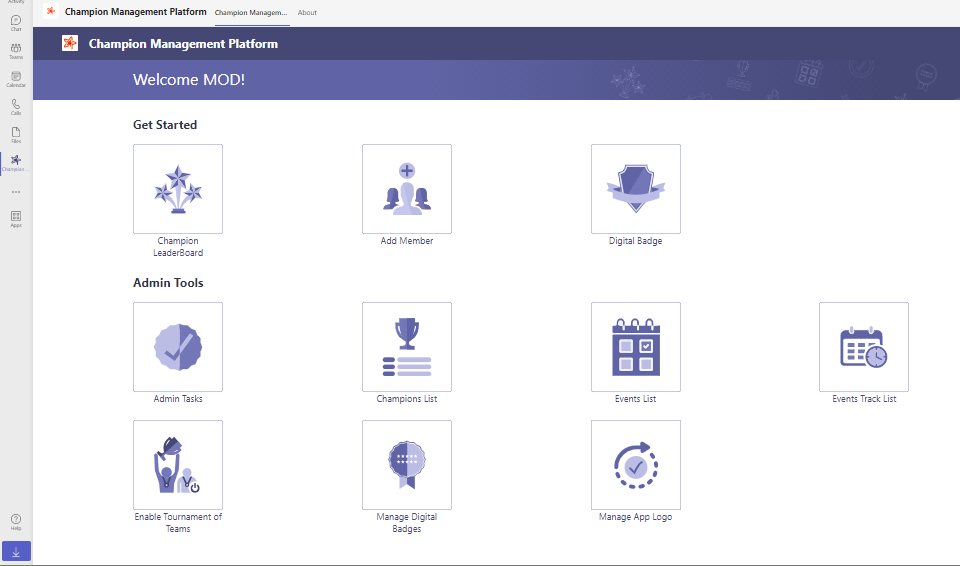

# Champion Management Platform

The Champion Management Platform is a custom Teams app that enables organizations to onboard and maintain Champions / SME in their organization in Teams, allowing everyone discover Champions right where they collaborate. Utilize this template for multiple scenarios: such as new initiative adoption, champion onboarding, or to maintain organization-wide Subject Matter Experts. Now also available is the Tournament of Teams module allowing for organizational wide tournaments promoting adoption themes you are skilling your users up on.

The app provides an easy interface for designated users to add members to the champion program, preview, collaborate and communicate and build a community of Champions.

