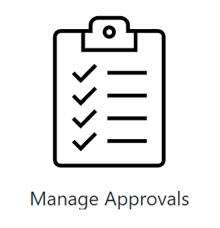

This page contains the different release details for Champion Management Platform,

## Version history
| Version | Release Date |
|----|----|
| 2.3 | Jul 28, 2022 |
| 2.2 | May 17, 2022 |
| 2.1 | Apr 4, 2022 |
| 2.0 | Dec 9, 2021 |
| 1.3 | Sep 03, 2021 |
| 1.2 | Jul 22, 2021 |
| 1.1 | Apr 1, 2021 |

## Release notes

### 2.3 (Jul 28, 2022)

Below improvements released,

- New Feature: Ability to create multiple tournaments using excel template.
- New Feature: Ability to start multiple tournaments at the same time.
- New Feature: Local language support (translations) available for 12 languages.
- Ability to approve/reject multiple requests at a time in manage approval screen.
- New card layout for both Member and Non Member Leaderboards along with improved Search and option to connect with the champions.
- Mobile responsive UI implemented.
- Bug Fix: Incorrect ranking in leaderboard when applying search filters.
- Bug Fix: Inaccurate behavior when adding multiple events of same type in "Record Event" section of Leaderboard.

### 2.2 (May 17, 2022)

Below improvements released,

- Upgraded SPFx version from 1.9.1 to 1.13.0 and its related NPM packages. 
- New Feature: Implemented new logo for the app.
- New Feature: Tournaments Report is available for admins to view visual metrics of completed tournaments along with list of participants for each tournament.
- Other Changes: Few minor UI enhancements, accessibility improvements.

### 2.1 (Apr 4, 2022)

Below improvements released,

- Bug Fix: Addressed an issue with tournament ranks/points not getting updated correctly for some customers within the Tournament of Teams leaderboard.
- New Feature: Multi-Tournament support within the Tournament of Teams module. Organizations can now have multiple tournaments occurring at one time
- New Feature: Introduced image preview feature for the Digital Badge module. Users can now preview their profile pictures with different badges available to them before applying it.
- New Feature: Implemented the Digital Badge feature native to Tournament of Teams. Users can now use the Digital Badge feature without being added as a member of the Champion Management Platform.
- New Feature: Implemented an ability that allows admins to update the logo of the Champion Management Platform that sits in the top application bar. Admins will now see a new icon "Manage App Logo" under the "Admin" section in the home page of the App. Upon replacing the image in the SharePoint library, the new app logo will be shown.
- New Feature: Implemented multilingual support for the application. English support at the moment
- Other Changes: Minor UI fixes.

### 2.0 (Dec 9, 2021)

Below improvements released,

- New and revamped User Interface.
- Upgraded NPM packages to recommended version for better performance, security, and latest fixes
- New module “Tournament of Teams” integrated to “Champion Management Platform” app. 
- “Multiple Badges” feature implemented under “Digital Badges” section. Users can now select from the available badges to apply on profile pictures. Admins will have the ability to manage digital badges and tag them to tournaments created with “Tournament of Teams”
- Connected experiences to app info, support via GitHub issues list, and Feedback portal through application banner
- Enhanced event recording with improved leader board dashboard views and multiple event and recording workflows

### 1.3 (Sep 03, 2021)

Below improvements released,

- Improved App installation process to fix issues while installing the app,
- Upgraded NPM packages to recommended version for better performance, security and latest fixes,
- Fixed an issue where the App is not working as expected when more than 100 champions are added to the system,
- Fixed an issue with incorrect rank of current user being displayed on the side bar under Leaderboard screen

### 1.2 (Jul 22, 2021)

Below improvements released,

- 'Member List' is now created right under 'ChampionManagementPlatform' site. This was created in the root site in version 1.1
- 'Manage Approvals' functionality is added to the App. The Admins can now see this additional feature in the home page. This screen can be used by the admins to Approve/Reject the champion nominations easily.

 

- Column type for 'Description' is modified to 'Single line of text' from 'Choice'
- 'Member Name' and 'Event Name' columns are added to 'Event Track List' SharePoint list.