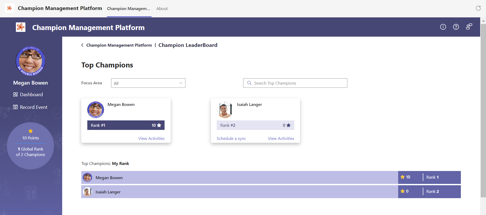
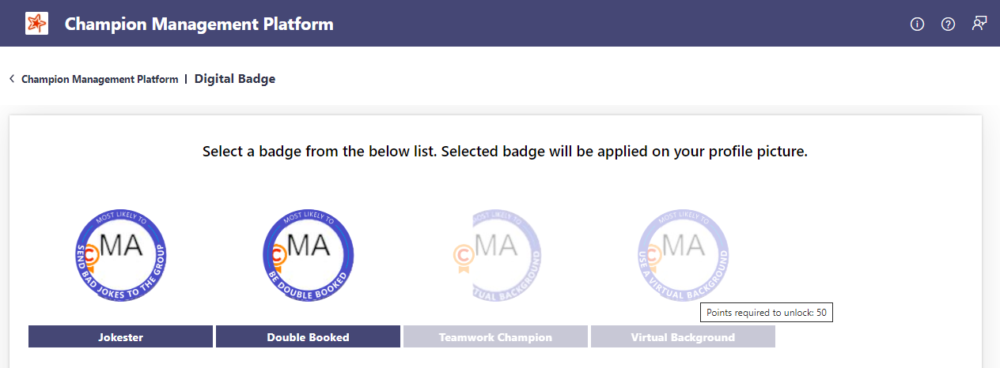
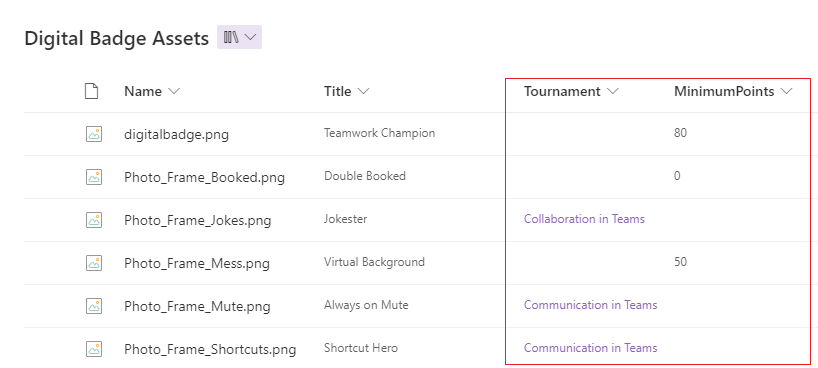

### Overview

1.  Champion Management Platform operates as an app in Microsoft Teams that is installed locally in your tenant by your tenant administrator or any user who has the capability to side load the application.
2.  Once installed, it can be accessed via “+Add a tab”  option at the top of the channel within a team. ***Channel > Add a tab > Champion Management Platform*** or from accessing the platform as a personal app on the left rail by ***Selecting "..." for more apps in left rail of Teams > searching for Champion Management Platform***
3.	The app installation process will create a SharePoint site “ChampionManagementPlatform” and SharePoint list (Members List ) in this site to store all users who are nominated to be a champion. Two additional lists(“Events List” and “Events Track Details”) are created to track the events and points. A local administrator is responsible for maintaining this SharePoint list. This person can be the individual who manages the Champion program for the organization or his/her delegate.
4.	The app provides an easy interface for approved employees (Champions) to showcase their Focus area, preview, collaborate and even add their colleagues as new champions.
5.	There are 4 major components in Champion Management Platform. 
> *  Champion management
> *  Leaderboard 
> *  Digital Badge
> *  Tournament of Teams
6.	The Champions will be earning points for hosting events, writing Blogs, moderating Office hours etc., Leaderboard ranks all the champions based on their points globally, regionally, and even by focus area.
7.	Point accumulation , ranking logic, Event details are configurable by the Admin based on the organization  needs.  

 

### Champion Leaderboard

Leaderboard solution is intended to add a gaming aspect to the Teams Champions program by allowing champions to earn points for the various ways they are promoting and supporting the internal adoption of their areas of interest. This also gives an opportunity to reflect their activity in comparison to other champs. Leaderboard has mainly 2 different views based on the role of that employee.
Roles can be categorized as: 
* i.	Admin/Moderator OR Champion
* ii.	Employee 

### Admin/Moderator OR Champion view

In our Champions program, Admin is a Champion by default.  The Champion view is to enable Administrator or Champions to identify all the members of the Champions program. 
 

      

An Admin / Champion can do the following: 

1.	Access Champion Leaderboard
- To view their current points total.
- To view their Global rank and how they rank against others globally.
- Access their dashboard with list of events they have supported.
- Add and submit upcoming events to earn points associated with it.  Example, hosting office hours can earn 10 points, whereas writing a blog can earn 5 points. 
2.	 Nominate and approve an employee to be a champion (Add members ) 
- An Admin can add employee as a Champion.
- Where as an existing Champion can nominate their peers. 
- Admin will review and approve the nomination.
3.	Earn a digital badge that can be displayed as an overlay on their profile image. *Refer to Digital Badge section. 

### Employee view
Leader board encourages the employees to get connected to the Champions in their organization.
1.	 Every employee can access the Champion Leader board.
2.	Through Champion Leaderboard, an Employee can identify all the Champions globally or can filter by a particular Focus area or by region option.
3.	Employee can also “Become a Champion” by submitting their information.
  

      
     
### Add Members 
Admin and current Champions of the program can nominate(***Add Members***) peers as Champions. Additional responsibility falls on the admin to maintain the Champions SharePoint list. *The approval process stays with the Admin only.*

The Admin can approve/Reject the champion nominations using Manage Approvals screen. 

### Digital Badge 
Digital Badge is intended to allow Microsoft 365 Champions to apply a ‘Champion’ badge on their profile image. It provides an easy and seamless process to share the recognition as a champion with the team.
  

 

CMP administrators can upload multiple badges in the “Digital Badge Assets” library in the share point site. Champions can select from multiple badges and apply on their profile picture. 
  
 

Additionally, administrators can also tag a digital badge with a specific tournament in the "Digital Badge Assets" list in share point when Tournament of Teams is enabled. Champions would have to complete a tournament to earn tournament specific badges. 

To make a digital badge open to all champions do not tag any tournament for that badge in the "Digital Badge Assets" list. The "Tournament" field in the list should be left empty.
  
 

### Tournament of Teams

- Tournament of Teams enables the organization to create and conduct tournaments for anyone in the organization to use to drive healthy usage habits and skilling on the areas of focus. The App also includes a gamification element where users gain points by completing activities assigned as part of the tournament. Users also gain access to tournament specific badges once they complete the tournaments. They can apply the badges using Digital Badge feature of Champion Management Platform. (note that at this time the digital badge component is only enabled for Champions and will be enabled in a future release for all users) 
- Tournament of Teams is not enabled by default. It must be enabled by CMP admin from the CMP landing page’s Admin section. By default, the Champion Management Platform admin who enables “Tournament of Teams” from CMP Admin section will be added as Admin for Tournament of Teams. More admins can be added through the Manage Admins section of the Tournament of Teams landing page.
  
 

After enabling Tournament of Teams, it is available for all the users on CMP home page.  
 
 
   

 
