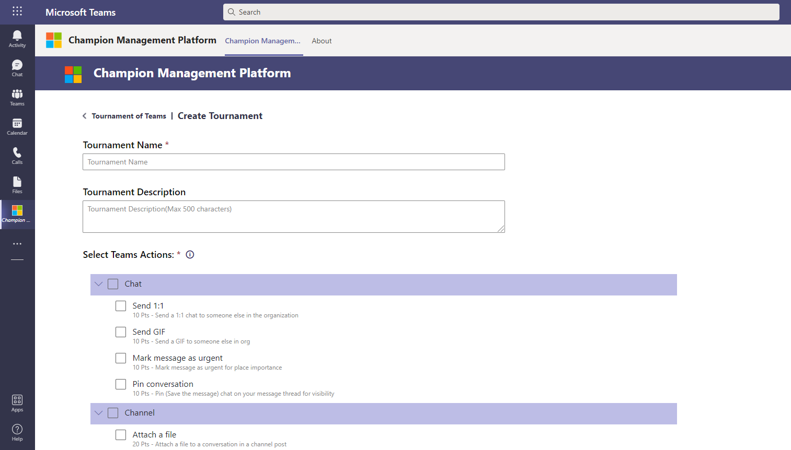
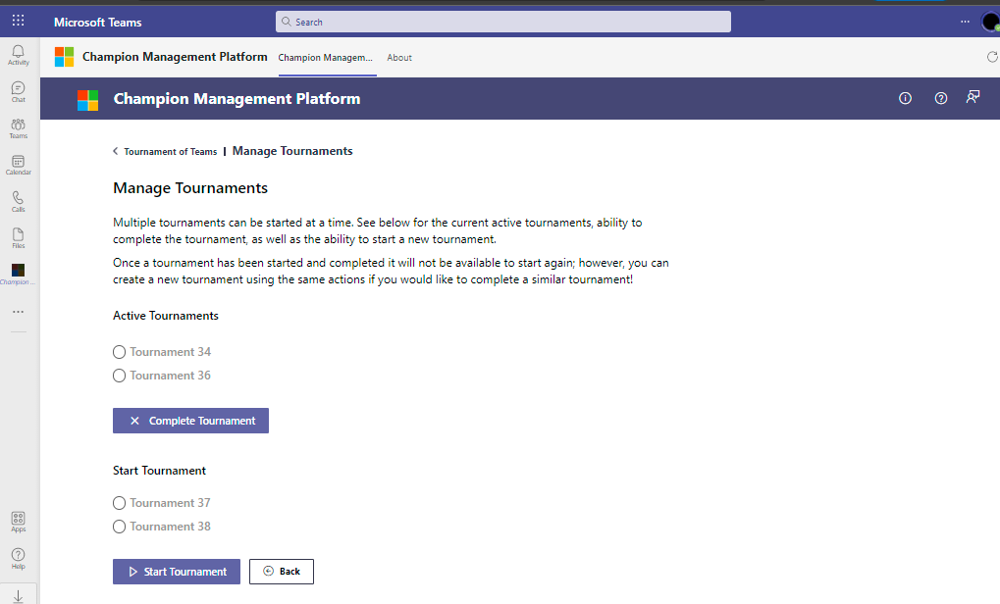
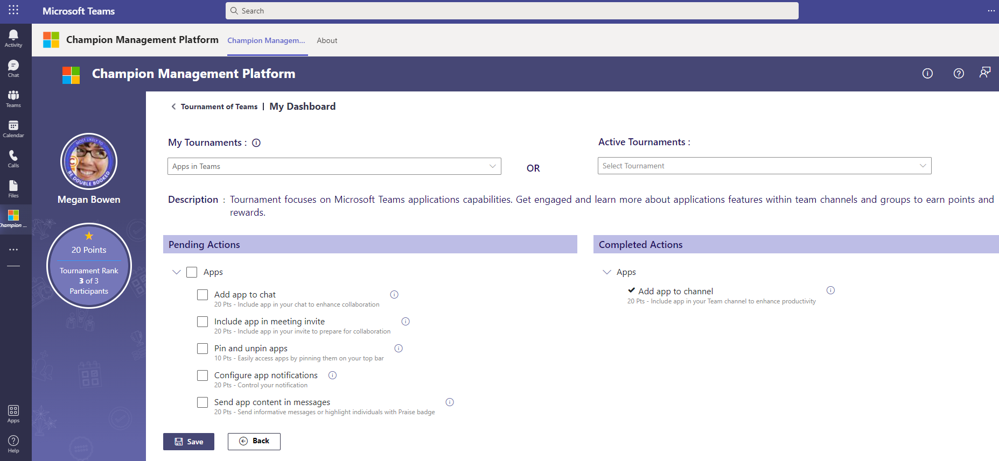
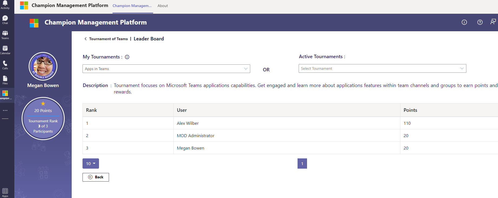
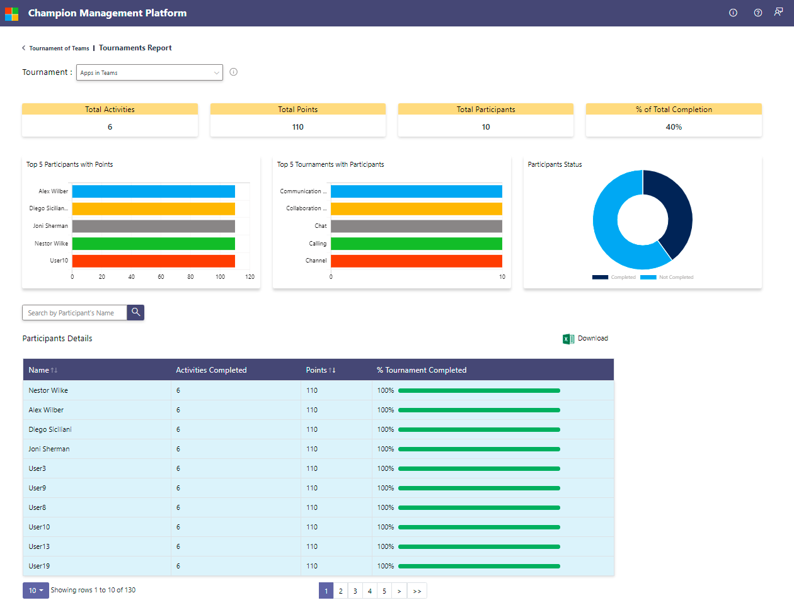

### Enable Tournament of Teams

Tournament of Teams is not enabled by default. CMP admin needs to enable it from “Enable Tournament of Teams” link under Admin section of CMP home page. 

 

On enabling “Tournament of Teams”: 

1. Below lists are provisioned in the CMP share point site:

> * Actions List
> * ToT Admins
> * Tournament Actions
> * Tournaments
> * User Actions
> * Tournaments Report
> * Participants Report

2. “Tournament of Teams” link is visible under “Quick Start Guide” section of CMP home page. This link navigates the users to “Tournament of Teams” landing page. 

3. The CMP admin who enabled “Tournament of Teams” is added to “TOT Admins” list by default. Additional admins can be added directly to the list. 

4. Sample actions, tournaments and tournament badges are added by default.  

     

### Master Lists

“Manage Tournament Actions”, “Manage Admins”, “Manage Digital Badges” links open the master lists in the share point site. 

Below are the master lists in Share Point that need to be managed by the TOT Admins:

1. "Actions List" - Sample actions are loaded by default. TOT Admins can add additional actions in the same format as sample data.
2. "TOT Admins" - TOT Admins can add additional admins to this list.
3. "Digital Badge Assets" - Sample badges are loaded to this library by default and tagged to sample tournaments. Admins can upload new digital badges to be available to all champions. Admins also can load additional badges and map it to specific tournaments in this list. The tournament specific badges will show up only to the users who have completed that specific tournament.
4. "User Actions" contains a report of all actions taken by users and can be used for reporting the completed actions throughout Tournaments from users.

### Create Tournament

- Admins can create new tournaments by picking the Teams Actions from the list. New Teams Actions need to be added to the list “Actions List” in share point. 

- Created Tournaments are not started by default. “Start Tournament” screen should be used to start the tournament. 

     

### Manage Tournaments 

 - A tournament can be started or completed by an admin using “Manage Tournaments” screen. 

 - Multiple tournaments can be active at a time. 

     

### My Dashboard

- Champions can start participating in any of the active tournaments using “My Dashboard”.  

- Champions can select the tournament from either "My Tournaments" or "Active Tournaments" dropdown list. If a user has participated in any of the active tournaments already they will be listed under "My Tournaments" list. All the other active tournaments will be listed under "Active Tournaments" list.

- “My Dashboard” will show the Teams Actions available in the selected tournament. The champions can select the completed actions and save to earn points and a rank in that tournament which is displayed on the left side section of the page. 

- By default, the first tournament in the "My Tournaments" will be selected. If the user has not participated in any of the tournaments yet, first tournament in the "Active Tournaments" will be selected.

- The users must complete at least one action to be considered as a participant in that tournament. The ranks are calculated only among the participants. 

     

### Leaderboard

- Leader board is available to everyone. It shows the list of all participants in the selected active tournament along with their points and ranks. 
- By default, the first tournament in the "My Tournaments" will be selected. If the user has not participated in any of the tournaments yet, first tournament in the "Active Tournaments" will be selected.

     

### Tournaments Report

- Tournaments Report is available only to admins under "Admin Tools" section.
- Report feature is available only for completed tournaments.
- A report can be generated for "All Tournaments" or a particular tournament.

     
