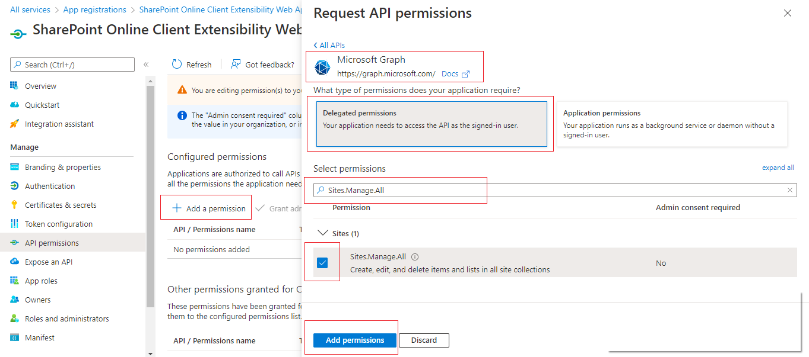
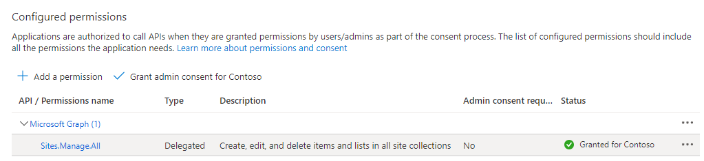
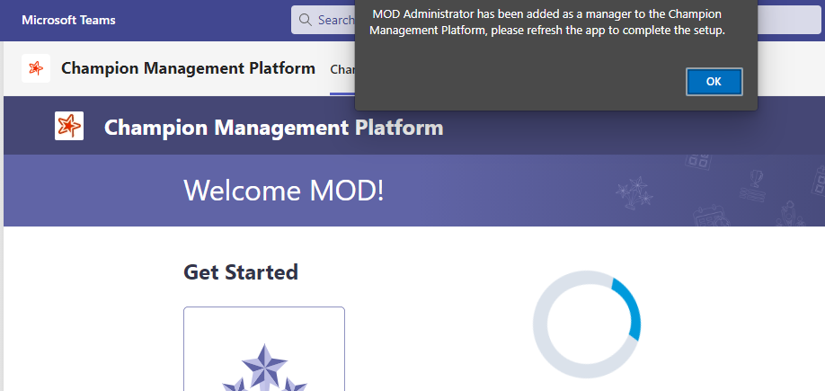
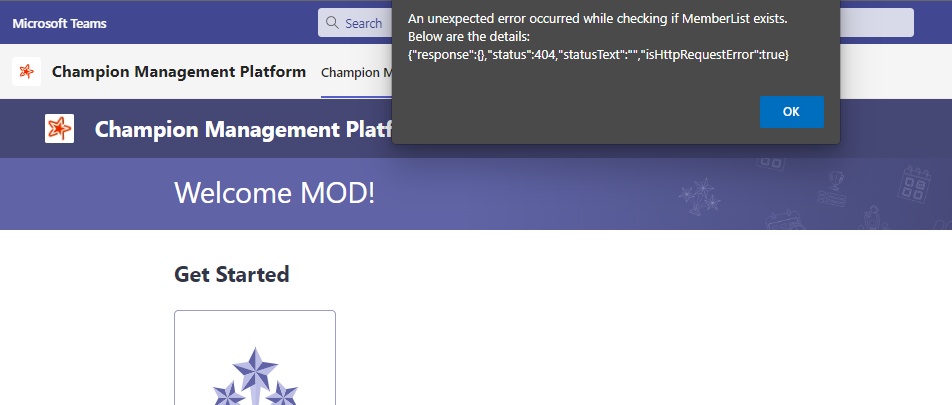

## Deployment Issues

### 1. I see an error 'Failed to sync solution to Teams' or 'Couldn't add app to Teams' when I click on 'Sync to Teams'(Classic App Catalog) or 'Add to Teams'(Modern App Catalog)?

### Solution

 Delete the app from Teams Admin Center and then click on 'Sync to Teams' or 'Add to Teams'.

### 2. I see an alert that says "An unexpected error occurred while setting up the App. Please try refreshing or loading after sometime" during first run experience.

### Solution

1. Verify the lists (Member List, Events List, Event Track Details List, Config List) are created in ChampionManagementPlatform site. If none of them are created, make sure the API permissions (User.ReadWrite, Sites.Manage.All) are approved in the SP admin center and then try adding the app again in Teams.

2. If the API permissions are already approved in SP admin center but still it is failing to create the lists, then follow the below steps

    - Check the API permissions in Azure Portal ( Azure >> App Registrations >> Search for "SharePoint Online Client Extensibility Web Application Principal" >> API Permissions).

    - Verify the permissions ("Sites.Manage.All", "User.ReadWrite) are added under 'Other Permissions' or 'Configured Permissions'. If not, add the missing permissions by clicking "+ Add a Permission" under Configured Permissions >> Choose Microsoft Graph >> Select Delegated Permissions >> Type the Permission in the search box >> Select the permission >> Click on Add Permissions

         

    - Then Grant Admin consent and make sure the Status column will be updated to confirm permissions are set.

         

    - Once this was done, wait for 10-15 mins and try accessing the CMP application from Teams.    

3. If the issue still occurs after performing above 2 steps then please try for a reinstall using an account with "Tenant admin" access:
    - Delete the App from Teams
    - Delete 'ChampionManagementPlatform' SharePoint site from both 'Active Sites' and 'Deleted Sites' from SharePoint admin center.
    - Delete the package from App catalog
    - Wait for 15-30 mins to clear the cache related issues.
    - Re upload the package to app catalog and deploy and sync to Teams. Ensure to approve the API permissions (User.ReadWrite, Sites.Manage.All) in SP admin center.
    - Install the App in Teams using the same tenant admin account. 
    - Wait until you see the alert with the success message "{loggedinuser} has been added as a manager to the Champion Management Platform, please refresh the app to complete the setup."
    - Provide required access in the "ChampionManagementPlatform" SharePoint site for other users to access the app.

### 3. Seeing a blue spinner spinning for a while, without showing any errors. Same behavior remains after refresh.

 

### Solution

1. If you are an admin and this happens when you are installing the app, please check the "Deleted Sites" in the SP admin center. If the "ChampionManagementPlatform" site is available under Deleted sites, then remove it from there and wait for 15-30 mins to clear the cache related issues. Then try installing the app again in Teams.

2. If you are a non-admin user and trying to access the app for a first time in Teams, this might happen when you are not having a permission to access the "ChampionManagementPlatform" SharePoint site. Please reach out to the site owner to get required access.
   

### 4. After installing the app in Teams, I am not seeing all the icons in the landing page.

### Solution

1. If you are an admin and this happens during the first run experience, please check the Member list in SharePoint site whether it has an item created with your details and the Role as Manager. 
    - If the Member list is not empty, someone else might have been already installed the app in your tenant. You can click on "Champion LeaderBoard" and submit a request to become a Champion. Then go to "Member List" in SharePoint, edit the item which has your details and update the below values and save it.

        Role:  Champion--> Manager 
        
        Status: Pending --> Approved
        
    - If the Member list is empty, then you might have refreshed the app before seeing the success message while installing it. Please delete the 'Member List' from SharePoint and reload the app in Teams. It will re-create the list and add an entry with your details and then you will see the success message in the app.

        

2. If you are a non-admin user, you might only see "Champion LeaderBoard" option in the app. You can click on that and submit a request to become a Champion. Upon approval from the Admin/Manager, you can access other features of the app.

### 5. I see an alert that says "An unexpected error occurred while checking if Member List exists" while refreshing the app during first run experience.
The below snapshot is from Teams in browser. The same message would look different in Teams client.

### Solution

This happens when the Member list exists in SharePoint site but any of the other lists might be missing. You might have refreshed the app before seeing the success message while installing it, that would break the process of creating the lists in SharePoint during the first run experience. Please follow the below steps

- Verify all the lists (Member List, Events List, Event Track Details List, Config List) are created in ChampionManagementPlatform site.

- If any of them are missing, please delete all these lists (Member List, Events List, Event Track Details List, Config List) and reload the app in Teams, it will re-create the lists.

- Wait until you see the success message and then refresh the app.

## Application Issues

### 1. Unable to select choices from the dropdowns (Region, Country, Group, Focus Area) in Add/Nominate Member or 'Become a Champion' screen.

 This might happen if the type of the dropdown column has been changed in Member List. Make sure the data type for these columns are set to "Choice" in the Member List in SharePoint site.

### 2. Why is my profile image not updated with Digital Badge?

 This happens when the permissions are not being inherited or approved after deploying package. The users must be able to update their profile images and Graph API permissions must have also been approved during package install. 

### 3. I have uploaded a new app icon in "CMP Logo" library but it is not reflected in the app in Teams.

This happens if the file name of the uploaded image is incorrect. Try to replace the **AppLogo.jpg** file whenever you are changing the logo image. The logo image file needs to have below specifications:

- Name: AppLogo.jpg

- Type: JPG

- Dimensions: 32 X 32
