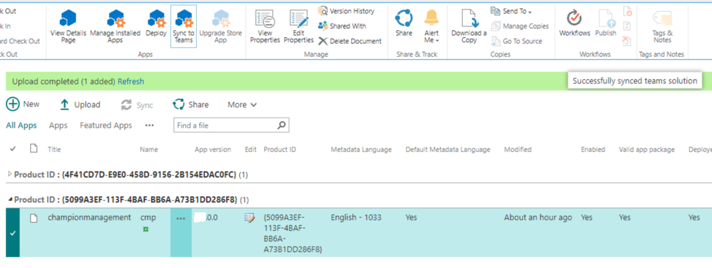
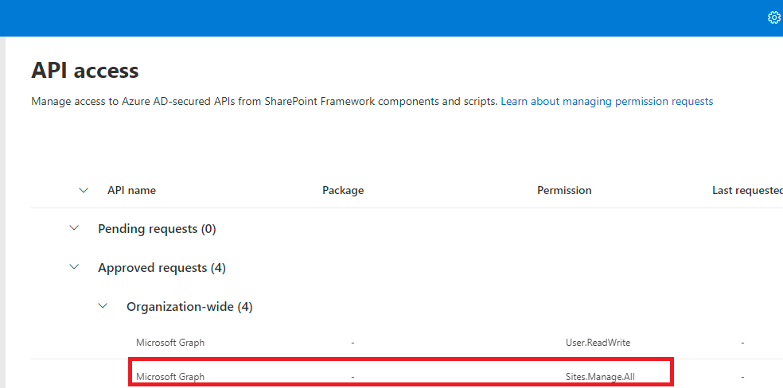

### Upgrade to version 2.3 from 2.2, 2.1, 2.0, 1.3 and 1.2

If you are already having version 2.2, 2.1, 2.0, 1.3 or 1.2 installed on your tenant follow the below steps to upgrade to version 2.3 with an admin account:

 NOTE: If you are using/seeing modern app catalog refer to the go to the [Modern App Catalog](#modern-app-catalog) section.

1.  Navigate to App Catalog with a tenant Admin account. Do not delete the existing package. Upload the new package that is downloaded from "sharepoint/solution" folder which will replace the existing package.  

     

2. Click on "Deploy".

     

3. "Check In" the package.

     

4. Select the package and click "Sync to Teams" from the ribbon and wait for the "Successfully synced to teams solution" message to appear.

     

5. The Champion Management Platform will be updated to the latest version and you will see changes reflected in Teams. Please note that if you do not see changes reflected in Teams after 30 minutes you can log out and back in and clear the Teams cache to see changes immediately. 

6. This steps applies only if you are upgrading from versions 2.1 or older. This step is not required if you are upgrading from version 2.2. <br>
If you already had "Tournament of Teams" enabled before the upgrade, click on "Enable Tournament of Teams" under "Admin Tools" section again. That will provision new lists for Tournament Reporting feature. "Tournament of Teams" icon will not be visible in the "Get Started" section without this step.

     

    **NOTE:** If there is any completed tournament before the upgrade, enabling Tournament of Teams will take couple of minutes (depends on number of completed tournaments) to load the data about completed tournaments into the Tournaments Report and Participants Report lists. Do not navigate away from the screen until it is completed with success message.

     

     

7. The below graph permissions can be removed from "API Permissions" in sharePoint admin portal only if the permission is not used in any other apps in your tenant. The upgraded package for CMP is not using these permissions anymore.

     

8. A new CMP logo has been added in this package. If you have not customized the app logo for the CMP application, you can delete the "CMP Logo" library from SharePoint site so that it will be automatically re-created when the app is launched and the MS logo will be replaced with new CMP logo image in the library.

### Modern App Catalog 

``` This section applies only if you are using/seeing modern app catalog.```

1. Navigate to App Catalog. Do not delete the existing package. Upload the new package that is downloaded from "sharepoint/solution" folder which will replace the existing package.

     

1. After uploading the package, select "Enable this app and add it to all sites" and click on "Enable App"

    

1. Skip this step.

    

1. Once done, click on "Add to Teams" to make this app available in Teams

    

``` Continue with steps 5 to 8 from the previous section.```

### Upgrade to version 2.3 from 1.1

If you are already having 1.1 installed on your tenant and want to upgrade to 2.2 the existing app and SharePoint site 'ChampionManagementSite' have to be deleted. 

If you have current members and events you will want to export those list items and import re-import them into the respective list areas. We have expanded our lists to have some additional data as well so you may need to populate additional fields. 

- Memberlist (same information) 
- EventList (same information) 
- EventTrackDetails (added two colums to contain event name + member name) 

Follow the below steps to upgrade your install and optionally also export and import the data you may already have for the program. 

1.	Delete the existing App from Teams.

     

2.	Delete 'Members List' from root site. <br/>
    a. Remember to export members if you are wanting to import the members back in

3.	Delete 'ChampionManagementPlatform' Sharepoint site from both 'Active Sites' and 'Deleted Sites'.

    a. Remember to export the Event List and Event Track List if you are wanting to import the events details back in. 

     
 
4. Delete 'cmp.sppkg' from App Catalog.	
5. Wait for around 30 minutes and startover the installation of new package following instructions from the section 'Deployment-Guide'.
6. Once the install has completed and first run is done, you can visit the site assets of the ChampionManagementPlatform and import any of the exported Champion data